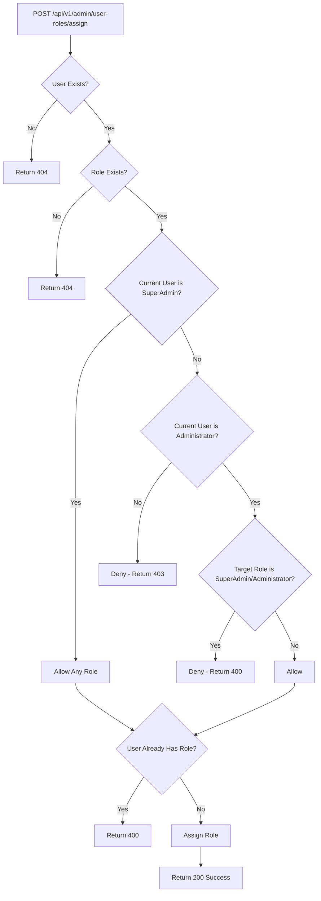
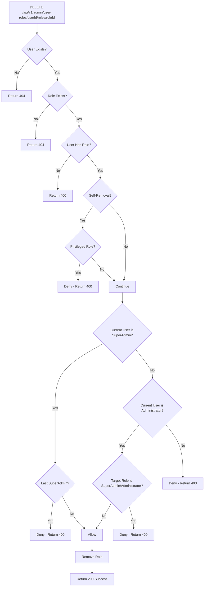
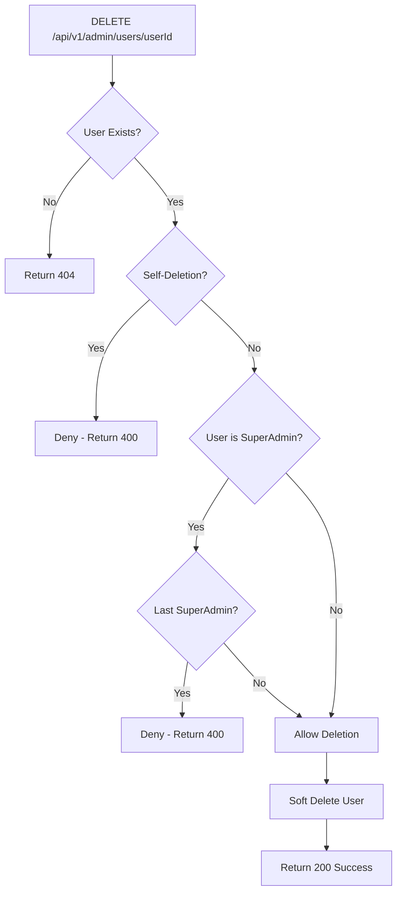

# Role Assignment & Removal Restrictions Implementation Guide

## 📋 Overview

This document describes the comprehensive security restrictions implemented for role assignment, role removal, and user deletion in the Archu Admin API, following Clean Architecture principles and best practices.

---

## 🔒 Security Rules Implemented

### 1. **Role Assignment Restrictions**

| Actor | Can Assign | Cannot Assign | Notes |
|-------|-----------|---------------|-------|
| **SuperAdmin** | Any role (SuperAdmin, Administrator, Manager, User, Guest) | None | Full privileges |
| **Administrator** | Manager, User, Guest | SuperAdmin, Administrator | Cannot escalate privileges |
| **Manager** | None | All roles | Blocked by authorization policy |

### 2. **Role Removal Restrictions**

| Actor | Can Remove | Cannot Remove | Notes |
|-------|-----------|---------------|-------|
| **SuperAdmin** | Any role from any user | Own SuperAdmin role, Last SuperAdmin | Protected operations |
| **Administrator** | Manager, User, Guest from any user | SuperAdmin, Administrator, Own Administrator role | Cannot demote privileged users |
| **Manager** | None | All roles | Blocked by authorization policy |

### 3. **User Deletion Restrictions**

| Actor | Can Delete | Cannot Delete | Notes |
|-------|-----------|---------------|-------|
| **SuperAdmin** | Any user except last SuperAdmin | Last SuperAdmin, Self | System integrity protection |
| **Administrator** | Any user except SuperAdmins | SuperAdmin users, Self | Cannot delete privileged users |
| **Manager** | None | All users | Blocked by authorization policy |

---

## 🏗️ Architecture & Implementation

### **Clean Architecture Layers**

```
┌─────────────────────────────────────────────┐
│   Presentation Layer (AdminApi)             │
│   - UserRolesController                     │
│   - UsersController                         │
│   - Authorization Policies                  │
└──────────────┬──────────────────────────────┘
               │
┌──────────────▼──────────────────────────────┐
│   Application Layer                         │
│   - AssignRoleCommandHandler                │
│   - RemoveRoleCommandHandler                │
│   - DeleteUserCommandHandler                │
│   - Business Logic & Validation             │
└──────────────┬──────────────────────────────┘
               │
┌──────────────▼──────────────────────────────┐
│   Domain Layer                              │
│   - RoleNames Constants                     │
│   - Domain Entities                         │
└──────────────┬──────────────────────────────┘
               │
┌──────────────▼──────────────────────────────┐
│   Infrastructure Layer                      │
│   - Repositories                            │
│   - Database Context                        │
└─────────────────────────────────────────────┘
```

### **Files Created/Modified**

#### ✅ **New Files Created:**

1. **`src/Archu.Application/Admin/Commands/RemoveRole/RemoveRoleCommand.cs`**
   - Command for role removal operations
   - Clean CQRS pattern implementation

2. **`src/Archu.Application/Admin/Commands/RemoveRole/RemoveRoleCommandHandler.cs`**
   - Business logic for role removal
   - Security validation
   - Last SuperAdmin protection
   - Self-removal prevention

3. **`src/Archu.Application/Admin/Commands/DeleteUser/DeleteUserCommand.cs`**
   - Command for user deletion operations
   - Clean CQRS pattern implementation

4. **`src/Archu.Application/Admin/Commands/DeleteUser/DeleteUserCommandHandler.cs`**
   - Business logic for user deletion
   - Last SuperAdmin protection
   - Self-deletion prevention

#### 📝 **Files Modified:**

5. **`src/Archu.Application/Admin/Commands/AssignRole/AssignRoleCommandHandler.cs`**
   - Added role assignment restrictions
   - Permission validation logic
   - Enhanced logging

6. **`Archu.AdminApi/Controllers/UserRolesController.cs`**
   - Updated to use RemoveRoleCommand
   - Enhanced API documentation
   - Security restrictions documented

7. **`Archu.AdminApi/Controllers/UsersController.cs`**
   - Added DeleteUser endpoint
   - Security restrictions documented
   - Comprehensive XML comments

---

## 🛡️ Security Validation Flow

### **Role Assignment Flow**



### **Role Removal Flow**



### **User Deletion Flow**



---

## 📊 API Endpoints & Examples

### **1. Assign Role (POST /api/v1/admin/user-roles/assign)**

#### Success Example (SuperAdmin assigns SuperAdmin):
```http
POST /api/v1/admin/user-roles/assign HTTP/1.1
Authorization: Bearer <superadmin-jwt-token>
Content-Type: application/json

{
  "userId": "3fa85f64-5717-4562-b3fc-2c963f66afa6",
  "roleId": "7ba85f64-5717-4562-b3fc-2c963f66afa9"
}
```

**Response (200 OK):**
```json
{
  "success": true,
  "data": {},
  "message": "Role assigned successfully",
  "timestamp": "2025-01-22T15:30:00Z"
}
```

#### Failure Example (Administrator attempts to assign Administrator):
```http
POST /api/v1/admin/user-roles/assign HTTP/1.1
Authorization: Bearer <administrator-jwt-token>
Content-Type: application/json

{
  "userId": "3fa85f64-5717-4562-b3fc-2c963f66afa6",
  "roleId": "administrator-role-id"
}
```

**Response (400 Bad Request):**
```json
{
  "success": false,
  "data": null,
  "message": "Permission denied: Only SuperAdmin can assign the 'Administrator' role. Administrators cannot create other administrators.",
  "timestamp": "2025-01-22T15:30:00Z"
}
```

### **2. Remove Role (DELETE /api/v1/admin/user-roles/{userId}/roles/{roleId})**

#### Failure Example (Self-removal of SuperAdmin):
```http
DELETE /api/v1/admin/user-roles/own-id/roles/superadmin-role-id HTTP/1.1
Authorization: Bearer <superadmin-jwt-token>
```

**Response (400 Bad Request):**
```json
{
  "success": false,
  "data": null,
  "message": "Security restriction: You cannot remove your own SuperAdmin role. This prevents accidental loss of system administration privileges. Another SuperAdmin must remove this role.",
  "timestamp": "2025-01-22T15:30:00Z"
}
```

#### Failure Example (Removing Last SuperAdmin):
```http
DELETE /api/v1/admin/user-roles/last-superadmin-id/roles/superadmin-role-id HTTP/1.1
Authorization: Bearer <superadmin-jwt-token>
```

**Response (400 Bad Request):**
```json
{
  "success": false,
  "data": null,
  "message": "Critical security restriction: Cannot remove the last SuperAdmin role from the system. At least one SuperAdmin must exist to maintain system administration capabilities. Please assign SuperAdmin role to another user before removing it from this user.",
  "timestamp": "2025-01-22T15:30:00Z"
}
```

### **3. Delete User (DELETE /api/v1/admin/users/{id})**

#### Failure Example (Self-deletion):
```http
DELETE /api/v1/admin/users/own-id HTTP/1.1
Authorization: Bearer <administrator-jwt-token>
```

**Response (400 Bad Request):**
```json
{
  "success": false,
  "data": null,
  "message": "Security restriction: You cannot delete your own account. This prevents accidental loss of system access. Another administrator must delete your account.",
  "timestamp": "2025-01-22T15:30:00Z"
}
```

#### Failure Example (Deleting Last SuperAdmin):
```http
DELETE /api/v1/admin/users/last-superadmin-id HTTP/1.1
Authorization: Bearer <superadmin-jwt-token>
```

**Response (400 Bad Request):**
```json
{
  "success": false,
  "data": null,
  "message": "Critical security restriction: Cannot delete the last SuperAdmin user from the system. At least one SuperAdmin must exist to maintain system administration capabilities. Please create or promote another SuperAdmin before deleting this user.",
  "timestamp": "2025-01-22T15:30:00Z"
}
```

---

## 🧪 Testing Guide

### **Test Scenarios**

#### ✅ **Role Assignment Tests**

| Test Case | User Role | Target Role | Expected Result |
|-----------|-----------|-------------|-----------------|
| SA-01 | SuperAdmin | SuperAdmin | ✅ Success |
| SA-02 | SuperAdmin | Administrator | ✅ Success |
| SA-03 | SuperAdmin | Manager | ✅ Success |
| AD-01 | Administrator | SuperAdmin | ❌ 400 - Permission Denied |
| AD-02 | Administrator | Administrator | ❌ 400 - Permission Denied |
| AD-03 | Administrator | Manager | ✅ Success |
| AD-04 | Administrator | User | ✅ Success |
| MG-01 | Manager | Any Role | ❌ 403 - Forbidden |

#### ✅ **Role Removal Tests**

| Test Case | User Role | Target Role | Scenario | Expected Result |
|-----------|-----------|-------------|----------|-----------------|
| RM-01 | SuperAdmin | Own SuperAdmin | Self-removal | ❌ 400 - Security Restriction |
| RM-02 | SuperAdmin | Last SuperAdmin | System protection | ❌ 400 - Critical Restriction |
| RM-03 | SuperAdmin | Manager from User | Normal operation | ✅ Success |
| RM-04 | Administrator | Own Administrator | Self-removal | ❌ 400 - Security Restriction |
| RM-05 | Administrator | SuperAdmin from User | Privilege escalation | ❌ 400 - Permission Denied |
| RM-06 | Administrator | Manager from User | Normal operation | ✅ Success |

#### ✅ **User Deletion Tests**

| Test Case | User Role | Target User | Scenario | Expected Result |
|-----------|-----------|-------------|----------|-----------------|
| DU-01 | SuperAdmin | Self | Self-deletion | ❌ 400 - Security Restriction |
| DU-02 | SuperAdmin | Last SuperAdmin | System protection | ❌ 400 - Critical Restriction |
| DU-03 | SuperAdmin | Regular User | Normal operation | ✅ Success |
| DU-04 | Administrator | Self | Self-deletion | ❌ 400 - Security Restriction |
| DU-05 | Administrator | Regular User | Normal operation | ✅ Success |

### **Manual Testing Steps**

1. **Setup Test Environment:**
```bash
# Start the application
cd src/Archu.AppHost
dotnet run
```

2. **Create Test Users:**
```bash
# Create SuperAdmin user via InitializeSystem endpoint
POST /api/v1/admin/initialization/initialize
{
  "userName": "superadmin",
  "email": "superadmin@test.com",
  "password": "SuperAdmin123!"
}

# Create Administrator user
POST /api/v1/admin/users
{
  "userName": "admin",
  "email": "admin@test.com",
  "password": "Admin123!"
}

# Assign Administrator role
POST /api/v1/admin/user-roles/assign
{
  "userId": "<admin-user-id>",
  "roleId": "<administrator-role-id>"
}
```

3. **Test Each Scenario:**
   - Use Postman or Scalar UI
   - Test with different user tokens
   - Verify expected responses
   - Check logs for security warnings

---

## 📝 Code Quality & Best Practices

### **✅ Clean Architecture Compliance**

1. **Separation of Concerns:**
   - Commands in Application layer
   - Controllers in Presentation layer
   - Domain logic in Domain layer

2. **CQRS Pattern:**
   - Commands for write operations
   - Clear command/handler separation

3. **Dependency Inversion:**
   - Interfaces defined in Application
   - Implementations in Infrastructure

4. **Single Responsibility:**
   - Each handler has one job
   - Validation methods are private and focused

### **✅ SOLID Principles**

1. **Single Responsibility:** Each handler manages one command
2. **Open/Closed:** Extensible through new commands
3. **Liskov Substitution:** Interfaces respected
4. **Interface Segregation:** IUnitOfWork provides specific repositories
5. **Dependency Inversion:** Depends on abstractions, not concretions

### **✅ Security Best Practices**

1. **Defense in Depth:**
   - Authorization at policy level
   - Validation at command level
   - Business rules at handler level

2. **Fail-Secure Defaults:**
   - Deny by default
   - Explicit allow only

3. **Comprehensive Logging:**
   - All security decisions logged
   - Warning for denied operations
   - Information for successful operations

4. **Principle of Least Privilege:**
   - Minimum necessary permissions
   - Clear role hierarchy

---

## 🔍 Logging & Monitoring

### **Log Levels & Events**

| Event | Level | Example |
|-------|-------|---------|
| Successful role assignment | Information | "Role 'Manager' successfully assigned to user 'john.doe' by admin {AdminId}" |
| Denied role assignment | Warning | "Role assignment denied: Admin {AdminId} (Administrator) cannot assign role SuperAdmin" |
| Self-removal attempt | Warning | "Self-removal denied: Admin {AdminId} cannot remove their own 'SuperAdmin' role" |
| Last SuperAdmin protection | Warning | "Cannot remove SuperAdmin role: Last SuperAdmin in system" |
| User deletion | Information | "User 'john.doe' (ID: {UserId}) successfully deleted by admin {AdminId}" |
| Self-deletion attempt | Warning | "Self-deletion denied: Admin {AdminId} attempted to delete their own account" |

### **Monitoring Recommendations**

1. **Alert on Multiple Denied Attempts:**
   - 5+ denied operations in 5 minutes
   - Potential attack or misconfiguration

2. **Alert on Last SuperAdmin Scenarios:**
   - Attempts to remove last SuperAdmin
   - Critical system integrity event

3. **Audit Trail:**
   - Log all role changes to audit table
   - Include timestamp, actor, target, action

---

## 🚀 Deployment Checklist

- [ ] All tests passing
- [ ] Code reviewed
- [ ] Documentation updated
- [ ] Security review completed
- [ ] Log monitoring configured
- [ ] Backup SuperAdmin account created
- [ ] Production database seeded with initial roles
- [ ] Emergency access procedure documented

---

## 📚 Related Documentation

- [Admin API Authorization Guide](ADMIN_API_AUTHORIZATION_GUIDE.md)
- [Admin API Implementation Summary](ADMIN_API_IMPLEMENTATION_SUMMARY.md)
- [Security Best Practices](SECURITY_BEST_PRACTICES.md)
- [Testing Guide](TESTING_GUIDE.md)

---

**Created:** 2025-01-22  
**Version:** 1.0  
**Status:** ✅ Implemented & Ready  
**Next Review:** 2025-02-22

