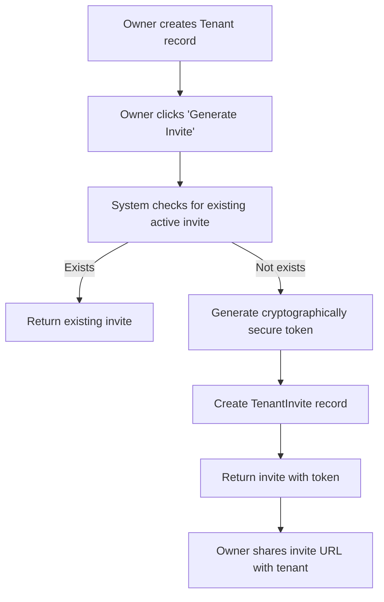
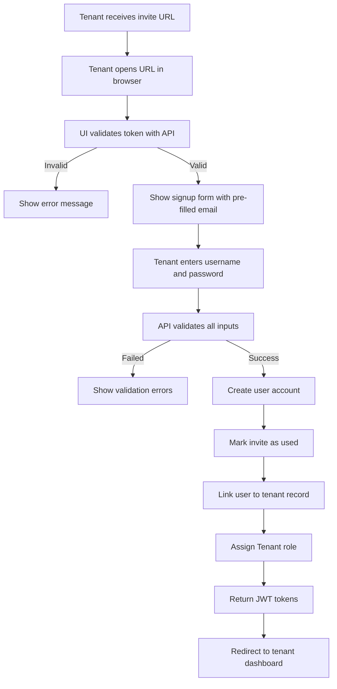

# Tenant Invite System

Complete guide for the tenant invite system that enables property owners to invite tenants to create accounts and access the tenant portal.

---

## 📚 Table of Contents

- [Overview](#overview)
- [Architecture](#architecture)
- [API Endpoints](#api-endpoints)
- [Workflow](#workflow)
- [Security Features](#security-features)
- [Database Schema](#database-schema)
- [Usage Examples](#usage-examples)
- [Error Handling](#error-handling)

---

## 🎯 Overview

The Tenant Invite System provides a secure workflow for property owners to invite tenants to the platform. Invites are tied to specific tenant records and ensure that only the intended person can create an account.

### Key Features

- ✅ **Token-based Invites**: Cryptographically secure invite tokens (32-character hex)
- ✅ **Expiration Management**: Configurable expiry (1-90 days, default 7 days)
- ✅ **Contact Validation**: Validates email matches invite (if provided)
- ✅ **Duplicate Prevention**: Returns existing active invite instead of creating duplicates
- ✅ **Concurrency Control**: Optimistic locking prevents race conditions
- ✅ **Role Assignment**: Automatically assigns "Tenant" role to new users
- ✅ **User-Tenant Linking**: Links created user account to tenant record

---

## 🏗️ Architecture

### Domain Layer

**TenantInvite Entity**:
```csharp
public class TenantInvite : BaseEntity
{
    public Guid OrgId { get; set; }
    public Guid TenantId { get; set; }
    public string InviteToken { get; set; }      // 32-char hex token
    public string Phone { get; set; }            // From tenant record
    public string? Email { get; set; }           // Optional from tenant
    public DateTime ExpiresAtUtc { get; set; }
    public bool IsUsed { get; set; }
    public DateTime? UsedAtUtc { get; set; }
    public Guid? AcceptedByUserId { get; set; }
}
```

### Application Layer (CQRS)

**Commands**:
- `GenerateInviteCommand` - Creates invite for tenant
- `AcceptInviteCommand` - Validates invite and creates user account

**Queries**:
- `ValidateInviteQuery` - Validates invite token before signup

**Validators** (FluentValidation):
- `GenerateInviteCommandValidator`
- `AcceptInviteCommandValidator`
- `ValidateInviteQueryValidator`

### Infrastructure Layer

**Repository**:
- `ITenantInviteRepository` - Interface for CRUD operations
- `TenantInviteRepository` - Implementation with token uniqueness checks
- Supports optimistic concurrency control

**DI Registration** (in `DependencyInjection.cs`):
```csharp
services.AddScoped<ITenantInviteRepository, TenantInviteRepository>();
```

---

## 🌐 API Endpoints

### 1. Generate Invite (Owner/Admin)

**Endpoint**: `POST /api/v1/organizations/{orgId}/tenants/{tenantId}/invites`

**Authorization**: Required (Bearer token)

**Request**:
```json
{
  "tenantId": "3fa85f64-5717-4562-b3fc-2c963f66afa6",
  "expiryDays": 7
}
```

**Response** (201 Created):
```json
{
  "success": true,
  "data": {
    "id": "7c9e6679-7425-40de-944b-e07fc1f90ae7",
    "orgId": "3fa85f64-5717-4562-b3fc-2c963f66afa6",
    "tenantId": "3fa85f64-5717-4562-b3fc-2c963f66afa6",
    "inviteToken": "a1b2c3d4e5f67890abcdef1234567890",
    "inviteUrl": "",
    "phone": "+1234567890",
    "email": "john.doe@example.com",
    "expiresAtUtc": "2026-01-16T10:00:00Z",
    "isUsed": false,
    "tenantFullName": "John Doe"
  },
  "message": "Invite generated successfully"
}
```

### 2. Validate Invite (Public)

**Endpoint**: `GET /api/v1/invites/validate?token={token}`

**Authorization**: None (Public endpoint)

**Response** (200 OK):
```json
{
  "success": true,
  "data": {
    "isValid": true,
    "tenantFullName": "John Doe",
    "phone": "+1234567890",
    "email": "john.doe@example.com",
    "errorMessage": null
  },
  "message": "Invite validated"
}
```

**Invalid Invite Response**:
```json
{
  "success": true,
  "data": {
    "isValid": false,
    "tenantFullName": null,
    "phone": null,
    "email": null,
    "errorMessage": "This invite has expired"
  },
  "message": "Invite validated"
}
```

### 3. Accept Invite (Public)

**Endpoint**: `POST /api/v1/invites/accept`

**Authorization**: None (Public endpoint)

**Request**:
```json
{
  "inviteToken": "a1b2c3d4e5f67890abcdef1234567890",
  "userName": "johndoe",
  "email": "john.doe@example.com",
  "password": "SecurePass123!@#"
}
```

**Response** (200 OK):
```json
{
  "success": true,
  "data": {
    "accessToken": "eyJhbGciOiJIUzI1NiIsInR5cCI6IkpXVCJ9...",
    "refreshToken": "abc123def456...",
    "expiresIn": 3600,
    "tokenType": "Bearer",
    "user": {
      "id": "9b1deb4d-3b7d-4bad-9bdd-2b0d7b3dcb6d",
      "userName": "johndoe",
      "email": "john.doe@example.com",
      "emailConfirmed": true,
      "roles": ["Tenant"]
    }
  },
  "message": "Invite accepted and user created successfully"
}
```

---

## 🔄 Workflow

### Owner Workflow



### Tenant Workflow



---

## 🔒 Security Features

### Token Generation
- Uses `RandomNumberGenerator` for cryptographic randomness
- Generates 32-character hexadecimal tokens (16 bytes)
- Uniqueness check with retry logic (max 10 attempts)

### Validation Checks

**Generate Invite**:
- ✅ Tenant must exist
- ✅ Tenant must belong to specified organization
- ✅ Tenant must have phone number
- ✅ Expiry days must be between 1-90

**Accept Invite**:
- ✅ Invite token must exist
- ✅ Invite must not be used
- ✅ Invite must not be expired
- ✅ Email must match invite email (if provided)
- ✅ Email must be unique
- ✅ Username must be unique
- ✅ Password must meet complexity requirements:
  - Minimum 8 characters
  - At least one uppercase letter
  - At least one lowercase letter
  - At least one number
  - At least one special character (@$!%*?&#)

### Concurrency Control

Uses optimistic concurrency control to prevent race conditions:
- Row version check on invite update
- Catches `DbUpdateConcurrencyException`
- Returns appropriate error if invite already used

### Role-Based Access

- Generate Invite: Requires authentication (Owner/Admin)
- Validate Invite: Public endpoint
- Accept Invite: Public endpoint (creates authenticated user)

---

## 💾 Database Schema

### TenantInvites Table

| Column | Type | Constraints | Description |
|--------|------|-------------|-------------|
| Id | uniqueidentifier | PK | Invite ID |
| OrgId | uniqueidentifier | FK, Required | Organization ID |
| TenantId | uniqueidentifier | FK, Required | Tenant ID |
| InviteToken | nvarchar(32) | Unique, Required | Invite token |
| Phone | nvarchar(15) | Required | Tenant's phone |
| Email | nvarchar(254) | Nullable | Tenant's email |
| ExpiresAtUtc | datetime2 | Required | Expiration date |
| IsUsed | bit | Required | Usage flag |
| UsedAtUtc | datetime2 | Nullable | Usage timestamp |
| AcceptedByUserId | uniqueidentifier | FK, Nullable | User who accepted |
| RowVersion | rowversion | Required | Concurrency token |

**Indexes**:
- Unique index on `InviteToken`
- Index on `TenantId`
- Index on `ExpiresAtUtc`
- Index on `IsUsed`

### Tenants Table Updates

| Column | Type | Constraints | Description |
|--------|------|-------------|-------------|
| LinkedUserId | uniqueidentifier | FK, Nullable | Linked user account |

**Relationship**: Tenant → User (many-to-one optional)

---

## 📖 Usage Examples

### Example 1: Generate Invite via HTTP

```bash
# Generate invite for tenant
curl -X POST "https://localhost:7123/api/v1/organizations/{orgId}/tenants/{tenantId}/invites" \
  -H "Authorization: Bearer {access_token}" \
  -H "Content-Type: application/json" \
  -d '{
    "tenantId": "3fa85f64-5717-4562-b3fc-2c963f66afa6",
    "expiryDays": 7
  }'
```

### Example 2: Validate Invite

```bash
# Validate invite token
curl -X GET "https://localhost:7123/api/v1/invites/validate?token=a1b2c3d4e5f67890abcdef1234567890"
```

### Example 3: Accept Invite

```bash
# Accept invite and create account
curl -X POST "https://localhost:7123/api/v1/invites/accept" \
  -H "Content-Type: application/json" \
  -d '{
    "inviteToken": "a1b2c3d4e5f67890abcdef1234567890",
    "userName": "johndoe",
    "email": "john.doe@example.com",
    "password": "SecurePass123!@#"
  }'
```

### Example 4: Using API Client

```csharp
// Generate invite
var request = new GenerateInviteRequest
{
    TenantId = tenantId,
    ExpiryDays = 7
};

var response = await tenantInvitesClient.GenerateInviteAsync(orgId, tenantId, request);
var inviteUrl = $"{baseUrl}/accept-invite?token={response.Data.InviteToken}";

// Accept invite
var acceptRequest = new AcceptInviteRequest
{
    InviteToken = token,
    UserName = "johndoe",
    Email = "john.doe@example.com",
    Password = "SecurePass123!@#"
};

var authResponse = await tenantInvitesClient.AcceptInviteAsync(acceptRequest);
// Use authResponse.Data.AccessToken for authenticated requests
```

---

## ❌ Error Handling

### Common Errors

| Error | HTTP Status | Message |
|-------|-------------|---------|
| Tenant not found | 400 Bad Request | "Tenant {id} not found" |
| Tenant wrong org | 400 Bad Request | "Tenant does not belong to organization {id}" |
| Missing phone | 400 Bad Request | "Tenant must have a phone number to generate an invite" |
| Invalid token | 400 Bad Request | "Invalid invite token" |
| Invite used | 400 Bad Request | "Invite has already been used" |
| Invite expired | 400 Bad Request | "Invite has expired" |
| Email mismatch | 400 Bad Request | "Email does not match the invite" |
| Email taken | 400 Bad Request | "Unable to create account. Please contact support." |
| Username taken | 400 Bad Request | "Username is already taken" |
| Validation error | 400 Bad Request | Detailed validation messages |

### Error Response Format

```json
{
  "success": false,
  "data": null,
  "message": "Invite has expired",
  "errors": null,
  "timestamp": "2026-01-09T11:00:00Z"
}
```

---

## 🔍 Best Practices

### For Owners/Admins

1. **Generate invites only for verified tenants** with complete contact information
2. **Use default expiry (7 days)** unless specific reason for different duration
3. **Share invite URL securely** via SMS or email to tenant's phone/email
4. **Monitor invite usage** to ensure tenants are onboarding successfully

### For Developers

1. **Always validate inputs** using FluentValidation validators
2. **Handle concurrency exceptions** when updating invite status
3. **Log security events** (invite generation, acceptance, failures)
4. **Construct full URLs at API layer**, not in application handlers
5. **Use optimistic concurrency** for all invite status updates

### For Tenants

1. **Use invite within expiry period** (default 7 days)
2. **Provide same email** as in tenant record (if email was provided)
3. **Choose strong password** meeting complexity requirements
4. **Keep login credentials secure** after account creation

---

## 📊 Monitoring & Metrics

### Key Metrics to Track

- Invite generation rate
- Invite acceptance rate
- Average time to accept invite
- Expired invite rate
- Failed acceptance attempts (by reason)

### Logging

Important events to log:
- Invite generation (orgId, tenantId, expiryDays)
- Invite validation attempts (token, result)
- Invite acceptance (userId, tenantId, success)
- Concurrency conflicts
- Security violations (invalid tokens, expired invites, email mismatches)

---

## 🔗 Related Documentation

- [API Guide](API_GUIDE.md) - Complete API reference
- [Authentication Guide](AUTHENTICATION_GUIDE.md) - JWT token handling
- [Architecture Guide](ARCHITECTURE.md) - System architecture
- [Database Guide](DATABASE_GUIDE.md) - Database schema details

---

**Last Updated**: 2026-01-09  
**Feature Version**: 1.0  
**Maintainer**: TentMan Development Team
